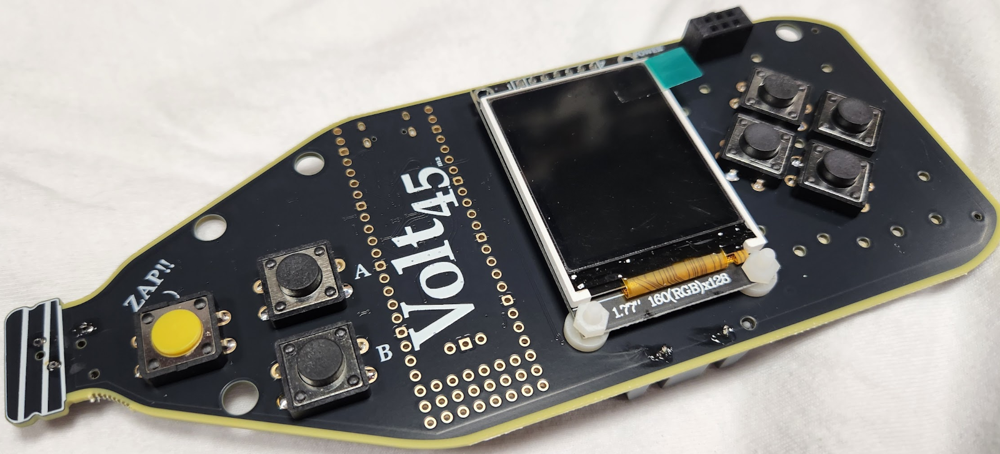
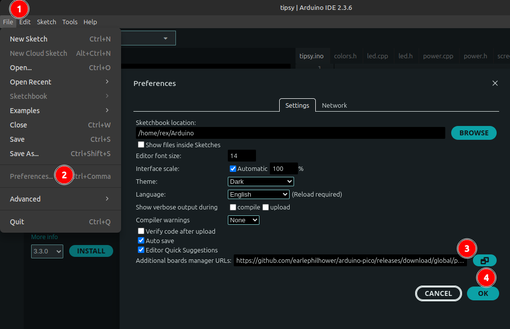
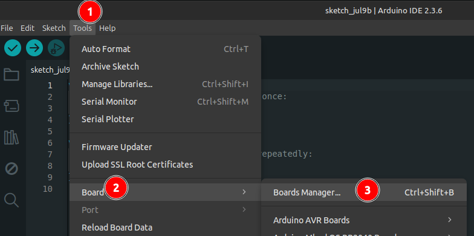
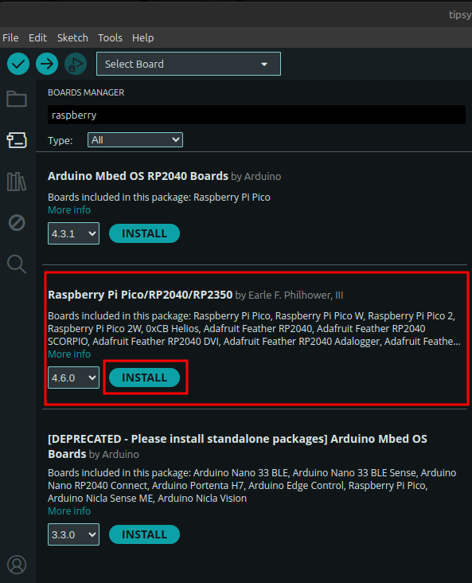
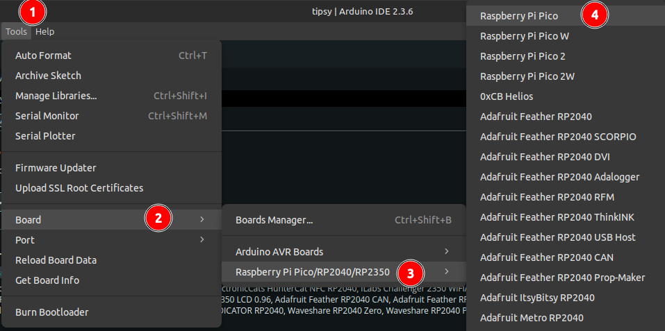
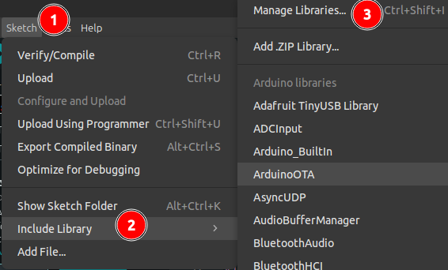
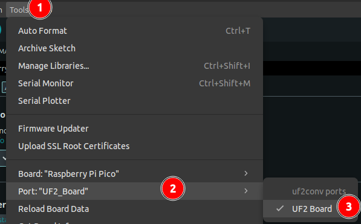
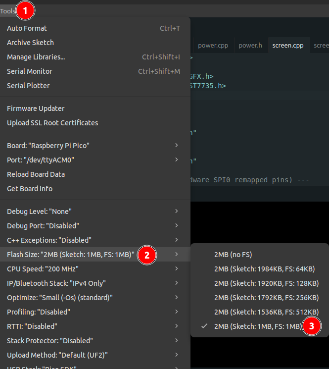

# Defcon 33 Tipsy Badge

---  

Video overview on youtube: https://www.youtube.com/watch?v=kScSm-BZAsY

---  

## Disclaimer

**WARNING: This device is experimental and is intended for use by informed adults for educational and entertainment purposes only.**

By using or assembling the Tipsy Badge, you acknowledge and agree to the following terms:

1. No Medical Claims - This badge is **not a medical device**. It has not been evaluated or approved by the FDA or any regulatory agency. It is not intended to diagnose, treat, cure, or prevent any disease or medical condition.

2. Assumption of Risk - Use of this device may affect your balance, coordination, or perception. You may experience dizziness, discomfort, disorientation, or unexpected physiological effects. Use at your own risk.  While we have taken all measures we could think of to ensure safety, the creators make no guarantees about the safety, reliability, or effectiveness of this device. You agree that **you are solely responsible** for any and all effects, injuries, or damages that may occur through the use or misuse of this device.

3. Not for Children - This device is **not intended for children or minors**. Users must be at least 18 years old and in good physical health. Do not use this device if you are pregnant, may become pregnant, want to impregnate someone else, have any medical condition (including but not limited to epilepsy, hearing disorders, balance issues, heart conditions), or have implanted medical devices (such as pacemakers).

4. Safe Use Conditions - Only use the device:

* Initially, while seated until familiar with the effects and operation.
* At all times, in a safe environment, away from stairs, ledges, or hard surfaces.
* When sober and fully alert.
* With fully functioning zap control hardware and software.
* With all safety precautions as described in the documentation.
* On batteries when in zap mode.  A faulty USB power supply could cause a hazardous condition.
* When the person wearing the electrodes is also the person controlling the zap button.

5. Limitation of Liability - The developers, designers, vendors, and affiliates of this project are **not liable for any direct, indirect, incidental, or consequential damages**, including personal injury or property damage, arising from the assembly, handling, use, misuse, or malfunction of this device.
You agree to **hold harmless and indemnify** the creators and all affiliated parties from any claims, demands, or legal actions resulting from use of the device.

6. No Warranty - This device is provided **"as is" without any warranties**, express or implied. All use is at your own discretion and responsibility.

7. Jurisdiction - Use of this device is subject to the laws and regulations of your local jurisdiction. It is your responsibility to determine whether possession or use of this device is legal in your area.

## Overview

This badge will be sold at the Hacker Warehouse Vendor Booth during defcon 33, half of the profits go to Tor. This electronic badge lets you connect conductive electrodes behind your ears, and using a very low current it can influence your balance in the left and right directions by affecting your vestibular system.

Main Modes:

* Steering Mode - to control the left and right direction that someone will feel "pushed"
* Wobble Mode - that makes it feel like you're being quickly pushed back and forth
* [Stroop Effect](https://en.wikipedia.org/wiki/Stroop_effect) color game, where you can test if positive or negative shock reinforcement improves your score

## How To Use It

1. Run the wires through the holes in the elastic band
2. Snap on the conductive electrode pads to the wires so they stay attached through the hole in the elastic band.
3. Put the elastic band on your head, there are a few ways to wear it, but the goal is to have the pads be firmly pressed behind your ears on your bare skin by your vestibular sensor system.  
4. Plug the 3.5mm wire into the badge under the "cap". 

Now go through the calibration process before using other modes. Skin resistance starts very high in our testing but drops after a few minutes of zapping. If the badge is not pushing more than 0.12ma of current through the pads, the output will be intentionally limited and you won't feel the intended effects.
If you encounter this:
* Reposition the pads (closer together helps, after current starts flowing you can slowly move the pads back to where you want them)
* Make sure the pads are pressed into your skin
* Lick or use the included lube on the pads to improve conductivity

Now that current is flowing in Calibration mode, you can move to Steering or Wobble modes and hold the zap button. Slowly increase the power or direction controls. You can monitor the voltage and current flowing through the pads with the waterfall graph.  
The color game lets you zap yourself with positive or negative reinforcement, set the power level of the zapping before the game starts. And like in all modes, the zap button must be pressed and held to actually zap.

The screen eats a lot of power, and the badge will continue to work longer than the boost power supply which is needed to zap. If the batteries are getting low and you attempt to zap, you may notice the voltage does not increase beyond the main power supply's ~2.5-3v. At this point a low battery warning should be displayed.  
You may want to keep one set of batteries "fresh" or at a higher voltage for use in zapping modes, and drain the other set of batteries while walking around and displaying a picture or other bling mode.

## Safety

We made this as safe as possible given the purpose of the badge. The zap button is in-line with any power flowing to the pads. You must press and hold the zap button or you will not get zapped (unless the button fails).  
There is a ~5ma hardware current limit (you can test this by shorting the pads together). There is a software 2, 3, 4 ma current limit. And there is USB detection, since zapping modes should not be used when USB is plugged in.

The first time you attempt to zap: sit down in a chair where you are less likely to fall, use the calibrate mode or a zap mode on the 3-4 power level, the person with the pads attached should control the zapping. Never use this while standing near stairs or on a hard surface, expect that you may fall.

We have no information on any negative short term or long term effects that can be caused by galvanic vestibular stimulation, but the use of the technique for entertainment and even medical purposes is limited. We've used it on ourselves extensively and have not had any concerns. We recommend everyone do research before using this badge, for example:  
https://dizziness-and-balance.com/testing/galvanic.html  
https://karger.com/aud/article/25/1-2/6/45441/Electrical-Vestibular-Stimulation-in-Humans-A  
https://pubmed.ncbi.nlm.nih.gov/36034303/

## Hardware

Powered by 2xAAA's, running a RPi Pico 2040 with 2mb flash. The flash memory is divided evenly and the badge acts as a USB mass storage device for loading custom photos.  
One 1.69bis SAO port, USB-C, Arduino compatible, 1.77" 160x128 rgb565 TFT display.  
Included are: Lube, button-hole elastic band with clip and triglide, 3.5mm wire to snap on conductive electrode pads, custom 1 inch dye-sub double ended lanyard, extra batteries, and battery clip.

## Loading Custom Photos

The flash memory is split into two 1mb partitions. The code is on one partition, and the photos and other files are stored on the other partition that acts as a USB mass storage device. After plugging this badge into a computer with a USB-C cable you should see a 'blingpic/' directory which contains the photos.  
Photos are stored in [targa image format](https://en.wikipedia.org/wiki/Truevision_TGA). You can create an image in this format using [GIMP](https://www.gimp.org/downloads/)

1. Crop or resize the image to 128 pixels wide by 160 pixels tall
2. Layer -> Transparency -> Remove Alpha Channel
3. [RLE compression](https://en.wikipedia.org/wiki/Run-length_encoding) works best when there are fewer colors. Depending on the image I recommend limiting the colors to between 16 and 128 colors using "Image -> Mode -> Indexed.. -> Maximum Number Of Colors"
4. "File -> Export as..." use a short filename with a ".tga" extension, click export
5. You should get a "Export Image as TGA" popup. You should check "RLE Compression" if it isn't already, and I usually use Origin Top Left
6. Copy the image over to the badge's 'blingpic/' directory. And make sure you sync or eject the badge safely so the file will be written to the filesystem.
7. Reboot the badge and you should see the image using the Bling -> Photos mode

## Flashing

This describes the process to reflash your badge, this may also be helpful if you see corrupted pictures from a corrupted file system.  
There is a bootp button for the rpi2040 to force it back into the boot loader, however in most cases this should not be needed to reflash the badge.

#### Prerequisites

1. Install Arduino IDE. Follow the [instructions from the official page](https://www.arduino.cc/en/Guide/).
2. After installing, launch the IDE and open the [tipsy.ino](tipsy/tipsy.ino)
3. Add an additional board manager URL. Go to `File -> Preferences` and paste the following url into the `Additional board manager URLs` field: `https://github.com/earlephilhower/arduino-pico/releases/download/global/package_rp2040_index.json`. Click "OK".
   
4. Open the "Board Manager" and install `Raspberry Pi Pico/RP2040/RP2350` board:

5. Select the `Raspberry Pi Pico` Board from the board manager menu. Go to `Tools -> Board -> Raspberry Pi Pico/RP2040/RP2350 -> Raspberry Pi Pico`

6. Install a few libraries. Go to `Sketch -> Include Library -> Manage Libraries`. Click "Install All" when prompted. 

* Adafruit GFX Library 
* Adafruit ST7735 and ST7789

**BEFORE FLASHING, PARTITION THE BOARD**

### Partitioning

Connect to the board using the USB-C connector. Select the board in `Tools -> Port -> UF2_Board` (or the associated COM port, after flashing this might change).

Partition the board by going to `Tools -> Flash Size -> 2MB (Sketch: 1MB, FS: 1MB)` 

* Compile and flash

# Attribution
Other similar projects that influenced this badge:  
https://www.youtube.com/watch?v=qj6u--lfeGo  
https://www.youtube.com/watch?v=vJcdilAzAqc  
https://www.youtube.com/watch?v=zJ2nFLz1-Cw  
https://www.youtube.com/watch?v=Px6sOkjj-ZE

modified triglide: https://www.printables.com/model/44580-webbing-triglide

*Half of the profits from the sale of this badge go to the Tor project. I am not funded by anyone, I front all costs of development myself. I do not charge for my time or effort, I only hope to recoup any material costs.
If you choose to purchase a badge, thanks for supporting Tor.*
